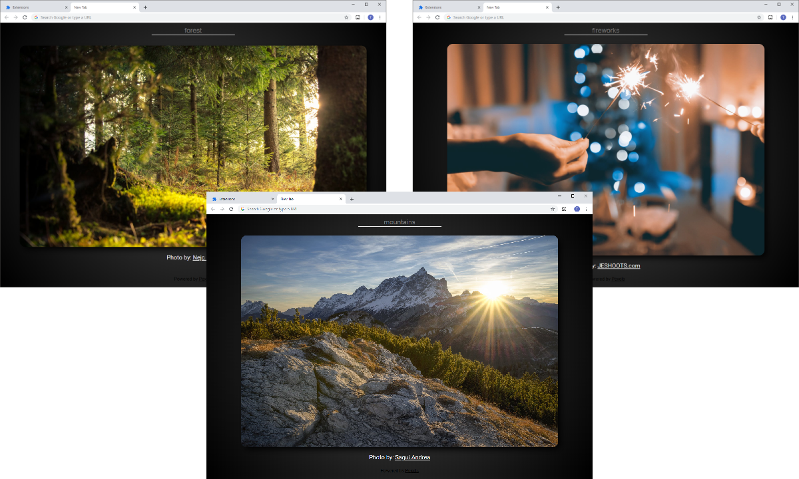

<div align="center">
</a>
</div>

<h1 align="center">Topic Tabs</h1>
<p align="center">
Generates backgrounds for new tabs based on a user-provided topic <br>
  Available for Chrome & Firefox
</p> 
<div align="center">
  
  []()
  [](https://github.com/tplobbregt/topic-tabs/issues)
  [](https://github.com/tplobbregt/topic-tabs/pulls)
  [](/LICENSE)
  
</div>

---

## Table of Contents

- [About](#about)
- [Demo](#demo)
- [Tools](#tools)
- [TODO](#todo)
- [Getting Started](#getting_started)
- [Authors](#authors)

<a name = "about"></a>

## About

Topic Tabs is a browser extension that generates backgrounds for new tabs based on a user-provided topic. To change topics, simply enter the new topic in the provided input box at the top of each tab. The extension will then reach out to the Topic Tabs API, which will retrieve a new list of image data from Pexels.

<a name = "demo"></a>

## Demo

<div align="center">
</a>
</div>

<a name = "tools"></a>

## Tools

- Extension

  - HTML / CSS / Javascript

- [Topic Tabs API](https://github.com/tplobbregt/topic-tabs-api)

  - [Node.js](https://nodejs.org/en/about/) | JS runtime
  - [Express](https://expressjs.com/) | Server framework

- Deployment

  - [Heroku](https://www.heroku.com/) | SaaS hosting platform for API

- Data
  - [Pexels API](https://www.pexels.com/api/) | Image and photographer information

<a name = "todo"></a>

## TODO

- [x] - Add to Chrome Web Store
- [ ] - Add to Firefox Add-ons store

<a name = "getting_started"></a>

## Getting Started

```bash
# Clone repo
git clone https://github.com/tplobbregt/topic-tabs
```

- Open Chrome extensions menu (chrome://extensions)
- Turn on developer mode
- Load unpacked extension

Learn more about loading Chrome extensions [here](https://developer.chrome.com/extensions/getstarted).

## App Info

<a name = "authors"></a>

### Author

Tyler Lobbregt

### Version

1.0.0

### License

This project is licensed under the MIT License
